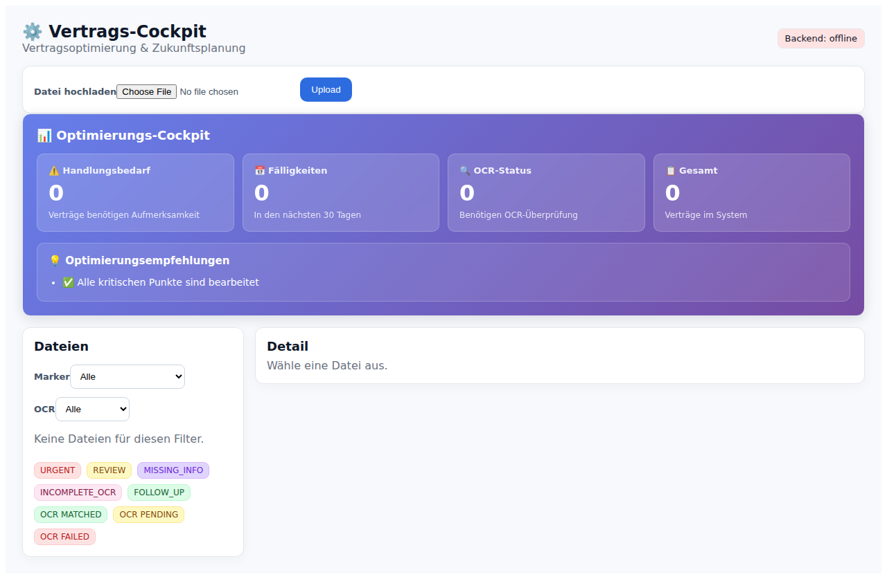
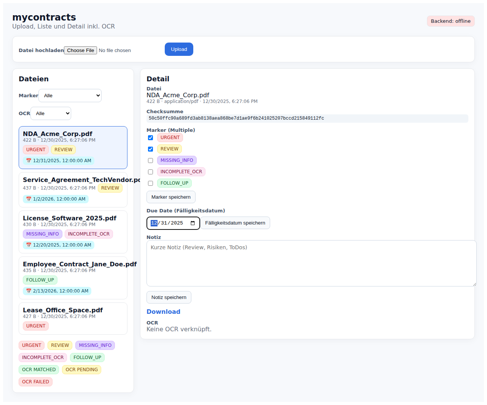
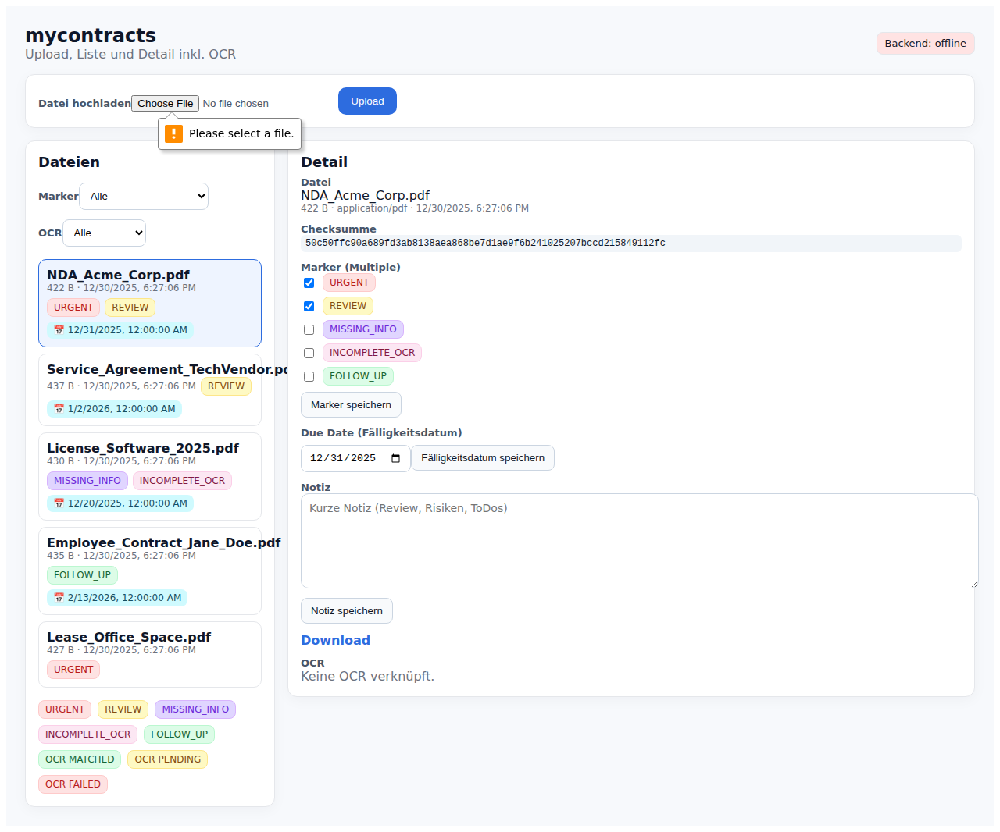

# Quick Start - Take Screenshots with UI Tests

## TL;DR - Get Screenshots in 5 Minutes

```bash
# 1. Install test dependencies (1 minute)
cd /workspaces/mycontracts/frontend
npx playwright install --with-deps

# 2. Make sure services are running
#    Backend should be on localhost:8080
#    Frontend should be on localhost:5173

# 3. Run the tests (2-3 minutes)
npm run test:ui

# 4. View screenshots
ls -la screenshots/
```

## Screenshots Will Be Created At

```
/workspaces/mycontracts/frontend/screenshots/
├── 01-app-loaded.png      # Initial app load
├── 02-file-list.png       # File list with markers
├── 03-detail-panel.png    # File detail view
├── 04-markers.png         # Marker interactions
├── 05-due-date.png        # Due date picker
└── 06-final-state.png     # Final app state
```

## What the Tests Do

Each test automatically:
1. ✅ Loads the app
2. ✅ Waits for elements to appear
3. ✅ Interacts with the UI (clicks, types, selects)
4. ✅ Takes a screenshot
5. ✅ Saves screenshot to `screenshots/` folder

**No manual clicking required!** The tests automate everything.

## Using Screenshots in Docs

Once you have screenshots, use them in README.md:

```markdown
### File List View


### Editing Markers


### Due Dates

```

## Common Issues

**Tests hang?**
```bash
# Kill any old processes
pkill -f "npm\|vite\|playwright"
sleep 2

# Restart services
cd /workspaces/mycontracts/backend
mvn spring-boot:run -DskipTests &

# In new terminal:
cd /workspaces/mycontracts/frontend
npm run dev -- --host --port 5173 &

# Run tests
npm run test:ui
```

**Browsers not found?**
```bash
npx playwright install --with-deps chromium
```

**App not reachable?**
```bash
# Check backend
curl http://localhost:8080/api/health

# Check frontend
curl http://localhost:5173
```

## View Test Report

After tests complete:
```bash
npx playwright show-report
```

This opens an HTML report with:
- Each test's screenshots
- Video recordings of failures
- Detailed trace logs
- Performance metrics

## For Documentation

You can now:
1. Include screenshots in README.md
2. Create visual workflows
3. Show UI changes in PRs
4. Demonstrate features to stakeholders
5. Document before/after states

Example:

```markdown
## How to Use Markers

1. Click a file to open details


2. Check the markers you want to apply


3. Set a due date if needed

```

---

**Next:** Run `npm run test:ui` to generate screenshots! 📸
